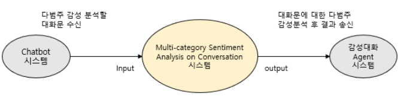

# Note

(2020/09/09) 1차 업데이트 되었습니다. 

(2020/10/27) api, api_test 추가 되었습니다.

(2020/12/12) 2차 업데이트 되었습니다.

(2020/12/23) 3차 업데이트 되었습니다.

# System/SW Overview

개발목표 : 딥러닝 기법 기반의 Text에 대한 다범주 감정 인식기 개발

다범주 감정 인식기 기능 흐름도
1. 감성 분석할 대화문 입력
2. 학습된 Model의 Sever로 입력받은 대화문 Input data 전송
3. 입력 받은 문장에 대하여 감성분석 실행
4. 분석 결과 및 다범주 감성별 예측도 Output data 출력

 

# Network Architecture and features

# How to install

git clone https://github.com/SKTBrain/KoBERT.git

cd KoBERT

pip install -r requirements.txt

* 인스톨 과정에서 에러 발생 시 https://visualstudio.microsoft.com/ko/vs/older-downloads/ 접속하여 [Microsoft Build Tools 2015 업데이트 3] 설치 후 인스톨

pip install .

# Main requirement

python >= 3.6

torch >= 1.2.0

mxnet==1.6.0

gluonnlp==0.9.1

sentencepiece==0.1.91

onnxruntime >= 0.3.0

transformers==2.10.0

# How to use

위의 인스톨 방법대로 Kobert를 설치한 후 200909_hyu_5th_text_emotion_recognition.py 실행

5th_test_data_sample.xlsx 파일과 같이 인풋을 주면  5th_test_data_sample_result.xlsx 와 같이 결과값 출력

