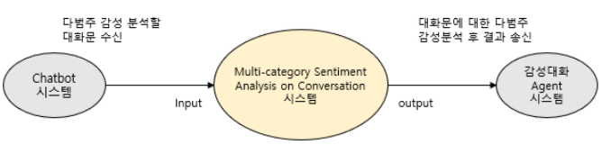

# Note

(2020/05/29) 5월 1차 업데이트 되었습니다. 

# System/SW Overview

개발목표 : 딥러닝 기법 기반의 Text에 대한 다범주 감정 인식기 개발

다범주 감정 인식기 기능 흐름도
1. 감성 분석할 대화문 입력
2. 학습된 Model의 Sever로 입력받은 대화문 Input data 전송
3. 입력 받은 문장에 대하여 감성분석 실행
4. 분석 결과 및 다범주 감성별 예측도 Output data 출력

# How to install

pip install -r requirements.txt -r requirements-local.txt

# Main requirement

python 3.6

Tensorflow == 2.1.0

Gensim == 3.8.3

Konlpy == 0.5.2

numpy == 1.14.0

Keras == 2.1.5

# Network Architecture and features

* 주요기능

병렬적으로 구성된 두 개의 BI-LSTM 모델을 통하여 각각 단어 단위와 음절 단위 수준으로 입력을 받은 후 각 셀(cell)에 대한 히든 벡터(hidden vector)와 마지막 셀을 통과한 히든 벡터간에 어텐션 메커니즘을 활용하여 어텐션 메커니즘이 적용된 컨텍스트 벡터를 구한다. 두 컨텍스트 벡터를 연결하여 하나의 컨텍스트 벡터로 만들고 완전 연결 레이어를 거친후에 가장 높은 확률 값을 가지는 특정 감정으로 분류한다.

* 특징

어절의 형태론족 구조(morphological structure)에 따라 한국어는 조사와 어미가 포함되는 교착어에 해당한다. 이러한 특징 때문에 문장을 토큰화 할 경우 형태소 단위로 나누는 것이 일반적이다. 형태소로 분리하는 기존 라이브러리들이 성능이 완전치 않아 어텐션 메커니즘을 활용 할 때 의미 없는 단어가 서로 연관지어 어텐션 되는 경우가 존재하였다. 이러한 한계점을 개선하기 위하여 모델이 입력값으로 형태소로 토큰화하한 단어 단위와 이보다 더 작은 음절 단위를 병렬적으로 입력을 받은 후 각각 어텐션 메커니즘을 통하여 두 개의 컨텍스트 벡터를 연결 해주는 방식을 활용하였다. 결과적으로 제안하는 방식을 통해 의미 없는 단어들과 어텐션 되는 부분을 보완하였으며 결과적으로 다범주 감성 분석 성능을 개선하였다.

* 사용방법

문장을 형태소 단위로 토큰화 후 Word2Vec을 활용하여 단어 단위의 벡터값과 음절 단위로 유니코드화 후 임베딩 레이러를 거친 벡터 값을 각각 입력값으로 활용한다. 병렬적으로 구성된 두 개의 BI-LSTM 모델은 각각 단어 단위와 음절 단위 수준으로 입력을 받은 후 각 셀에 대한 히든 벡터와 마지막 셀을 통과한 히든 벡터간에 어텐션 메커니즘을 활용하여 컨텍스트 벡터를 구하고 두 켄텍스트 벡터를 연결화요 활용한다. 연결된 컨텍스트 벡터를 완전 연결 레이러를 거친 후에 가장 높은 확률 값을 가지는 특정 감정으로 분류한다.

* 평가방법
 
평가 데이터 셋의 결과와 감정 인식 모듈에서 생성한 결과를 비교
한 감정 범주에 대한 인식률 (%) = (정답 수 / 평가 데이터 수) * 100%
7가지 감정의 평균 인식률 (%)을 정량적 목표 기준치로 선정

# Quick start
해당사항 없음

# HTTP-server API description
해당사항 없음

# Repository overview
해당사항없음

#

